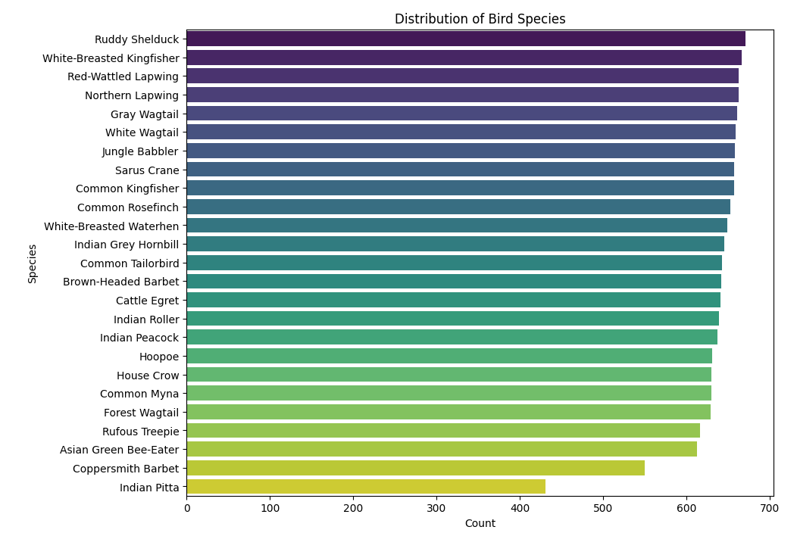

# 2024 월간 데이콘 저해상도 조류 이미지 분류 AI 경진 대회

<https://dacon.io/competitions/official/236251/overview/description>

데이콘에서 진행하는 저해상도 조류 이미지 분류 AI 경진 대회에 참가하였습니다.

좋은 성적을 거두진 못하였지만 이때까지 공부하였던 것들을 실제로 적용해 보는 좋은 기회가 된 것 같았습니다.

## 1.데이터셋
데이터셋은 TRAIN용 저해상도(64*64) 조류이미지 15,834장이 있으며 종류는 25가지 입니다.

